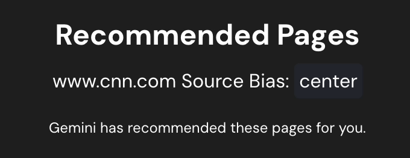

# Summary
A Google AI hackathon project by Michael Gathara and Jayden Pyles. Built on top of the [Chrome Extension Typescript Starter](https://github.com/chibat/chrome-extension-typescript-starter)

As you browse the web, Gemini Recommended Search scans your content and leverages Gemini's advanced capabilities to generate precise Google search queries. Instantly, you're presented with additional webpages tailored to you—allowing you to find content across the web that helps you.

In a time where AI aggregators are becoming a popular alternative to search engines, Gemini Recommended Search is a step towards a more personalized and intelligent web experience, which makes the web work for you.

## Demo
[](https://www.youtube.com/watch?v=g-iT-Xf_zSE)


## Features

### Smart Content Discovery and Content Summary
- Seamlessly discover relevant content as you browse
- Get intelligent recommendations based on your current page context
- Save time finding related resources across the web
- Get content summaries to enhance understanding

<p align="center">
    
</p>

### Summary Glance
- Get a summary of a website before visiting
- Simple and intuitive by clicking the <i>Star</i> button

<p align="center">
    
</p>

### Powered by Gemini AI
- Advanced content analysis for precise recommendations
- Real-time query generation tailored to your interests
- High-quality results powered by Google's latest AI technology

### Simple & Privacy-Focused
- No buttons to press, works automatically when you open. 
- Full control over the domains the extension can access

<p align="center">
    
</p>

### Beta: Bias Rating
- Automatically detect and display potential political or topical bias ratings for news sites as you browse
- Helps users make informed decisions about their news sources
- Provides transparency about content perspective and leanings
- Uses AI-powered analysis to evaluate article context and presentation

<p align="center">
    
</p>

## How to run
### Prerequisites

* [node + npm](https://nodejs.org/) 
* [Docker](https://www.docker.com/)
* [Make](https://www.gnu.org/software/make/)
* [Chrome Canary](https://www.google.com/chrome/canary/)

### Gemini Nano Setup
- Ensure you have Chrome Canary
- Sign up for the Gemini Nano Early Preview - [here](goo.gle/chrome-ai-dev-preview-join)
    - Learn more [here](https://developer.chrome.com/docs/ai/built-in)
- Navigate to `chrome://flags` 
- Search for `gemini` and enable all the flags
    - Prompt API for Gemini Nano
    - Summarization API for Gemini Nano
    - Writer API for Gemini Nano
    - Rewriter API for Gemini Nano
- Seach for ` Enables optimization guide on device` and set it to `Enable Bypass...`
- Disable the text safety flags to stop a bug from falsely flagging Gemini Nano content as non-english
    - Navigate to `chrome://flags/#text-safety-classifier`
- Navigate to `chrome://components`
    - Ensure you have `Optimization Guide On Device Model` with a version that is not `0`

Once you have enabled all of these and been given access to the early preview of Gemini Nano, you should be able to utilize an on-device Gemini model to use the extension

### Setup
- Copy the `.env.example` file and rename it to `.env`
    - You may fill out the env file if you'd like to use a local endpoint for testing, otherwise the extension will use our Google Cloud endpoint for Google Searches and your local on-device Gemini Nano model for AI capabilities


- Frontend
```
npm install
```

- Backend
```
make pull up
```

### Build frontend assets

> [!TIP]
> Rebuild the frontend everytime you make changes to the frontend or add a .env file and reload the extension on Chrome

```
npm run build
```

or

```
make build-ext
```

### Create .env file for API calls

The API is hosted on Google Cloud Run (and requires no extra setup), but only temporarily for testing purposes. If you want to host it locally, create an `.env` file in the root directory with the following:

```env
API_URL=http://localhost:8000
```

> [!IMPORTANT]
> This API is used for Google Search, All Gemini calls are utilizing Gemini Nano

### Load extension to chrome
- Navigate to `chrome://extensions` and enable developer mode
- Load `dist` directory
- Reload the extension on `chrome://extensions` whenever you rebuild the frontend

## Troubleshooting Tips
- If the extension does not showcase any recommendations, there is a chance that Gemini Nano is not loading properly. 
    - Copy the following into your chrome canary console
    ```
    await ai.summarizer.create();
    await ai.languageModel.create();
    ```
    - This loads up the models needed

## Usage Tips
- Click the extension icon to toggle recommendations on/off
- Click the star to get webpage summaries
- Click any recommendation to open in a new tab
- Use the options menu to customize domains and other settings

## Privacy Policy
- No personal data is collected or stored
- Page content is processed locally using Gemini Nano
- Only approved domains are analyzed (customizable in settings)
- No browsing history is tracked or shared

## Known Limitations
- Currently only supports English language content
- Requires Chrome Canary for Gemini Nano features
- Beta features may have limited accuracy

## License
This project is licensed under the MIT License - see the [LICENSE](LICENSE) file for details

## Acknowledgments
- Built with [Chrome Extension Typescript Starter](https://github.com/chibat/chrome-extension-typescript-starter)
- Powered by Google's Gemini AI technology
- Special thanks to the Chrome AI team for early access to Gemini Nano