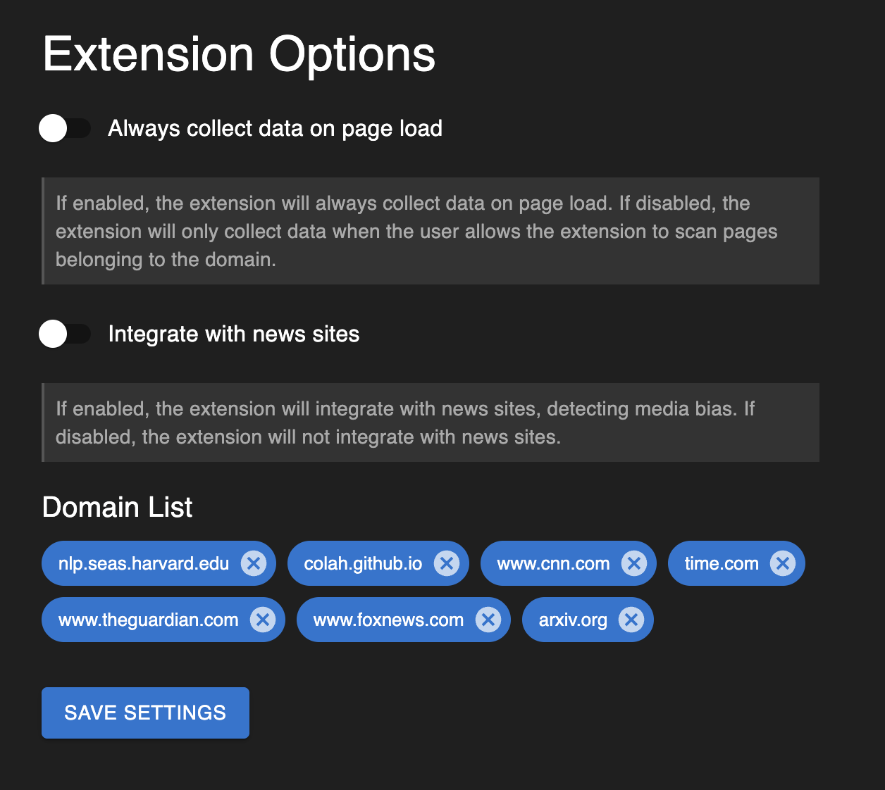

# Summary
A Google AI hackathon project by Michael Gathara and Jayden Pyles. Built on top of the [Chrome Extension Typescript Starter](https://github.com/chibat/chrome-extension-typescript-starter)

As you browse the web, Gemini Recommended Search scans your content and leverages Gemini's advanced capabilities to generate precise Google search queries. Instantly, you're presented with additional webpages tailored to you—allowing you to find content across the web that helps you.

## Features

### Smart Content Discovery and Content Summary
- Seamlessly discover relevant content as you browse
- Get intelligent recommendations based on your current page context
- Save time finding related resources across the web
- Get content summaries to enhance understanding


### Summary Glance
- Get a summary of a website before visiting
- Simple and intuitive by clicking the <i>Star</i> button

##### image

### Powered by Gemini AI
- Advanced content analysis for precise recommendations
- Real-time query generation tailored to your interests
- High-quality results powered by Google's latest AI technology

### Simple & Privacy-Focused
- No buttons to press, works automatically when you open. 
- Full control over the domains the extension can access



### Beta: Bias Rating
- Automatically detect and display potential political or topical bias ratings for news sites as you browse
- Helps users make informed decisions about their news sources
- Provides transparency about content perspective and leanings
- Uses AI-powered analysis to evaluate article context and presentation


## How to run
### Prerequisites

* [node + npm](https://nodejs.org/) 
* [Docker](https://www.docker.com/)
* [Make](https://www.gnu.org/software/make/)
* [Chrome Canary](https://www.google.com/chrome/canary/)

### Gemini Nano Setup
- Ensure you have Chrome Canary
- Sign up for the Gemini Nano Early Preview - [here](goo.gle/chrome-ai-dev-preview-join)
    - Learn more [here](https://developer.chrome.com/docs/ai/built-in)
- Navigate to `chrome://flags` 
- Search for `gemini` and enable all the flags
    - Prompt API for Gemini Nano
    - Summarization API for Gemini Nano
    - Writer API for Gemini Nano
    - Rewriter API for Gemini Nano
- Navigate to `chrome://components`
    - Ensure you have `Optimization Guide On Device Model` with a version that is not `0`

Once you have enabled all of these and been given access to the early preview of Gemini Nano, you should be able to utilize an on-device Gemini model to use the extension

### Setup

- Frontend
```
npm install
```

- Backend
```
make build up
```

### Build frontend assets

```
npm run build
```

or

```
make build-ext
```

### Load extension to chrome

Load `dist` directory

## Known Limitations
- Currently only supports English language content
- Requires Chrome Canary for Gemini Nano features
- Beta features may have limited accuracy
